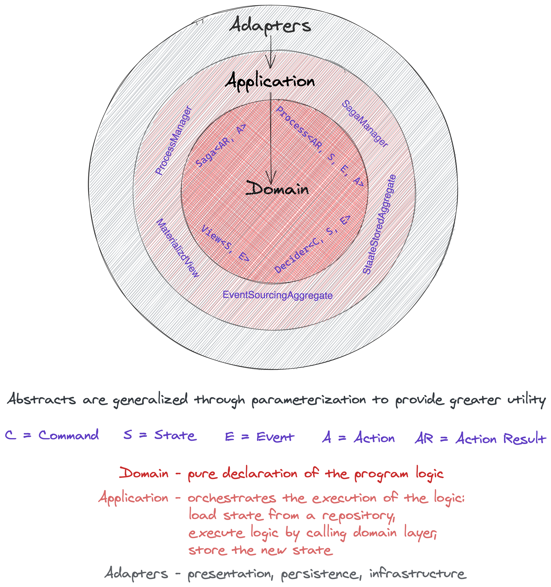

# Functional domain modeling - Examples

The word `domain` here means the area of interest in the business. When you are developing an `information system` to
automate activities of that business, you’re modeling the business. The abstractions that you design, the behaviors that
you implement, and the UI interactions that you build all reflect the business — *together they constitute the `model`
of the domain*.

## f(model)

These examples are demonstrating the usage of the [fmodel](https://fraktalio.com/fmodel)
library.

Library is written in [Kotlin](https://kotlinlang.org/) programing language by practicing functional
style ([Arrow](https://arrow-kt.io/)). It is a small library constructed out of generic data types that can be used to
effectively model any stateful information system.

It is truly decoupling the pure declaration of our program logic from the runtime. And therefore, the runtime has the
chance to see the big picture of our program and decide how to run and optimize it.

## Examples

To demonstrate that `pure declaration of our program logic` is separated from the runtime target and infrastructure, we
are going to
practice [onion architecture / ports and adapters](https://blog.ploeh.dk/2013/12/03/layers-onions-ports-adapters-its-all-the-same/)
in all examples, so get used to it ;).

The arrows in the image are showing the direction of the dependency. Notice that all dependencies point inwards, and
that Domain is not depending on anybody or anything.

### Event model
We are going to model a restaurant management system that is responsible for:

- managing restaurant menus and other information including location and opening hours
- managing the preparation of orders at a restaurant kitchen

To demonstrate that we are decoupling the pure declaration of our program logic (domain layer) from the runtime, we are
going to run our unique core domain logic in different ways by changing only `application` and/or `persistence` layers:

- [Example of State stored information system - Restaurant management - Spring Boot](state-stored-system)
- Example of Event-sourced information system (Axon Server as an event store) - Restaurant management - Spring Boot
- Example of Event-sourced information system (Event Store DB as an event store) - Restaurant management - Spring Boot

---
Created with :heart: by [Fraktalio](https://fraktalio.com/)
